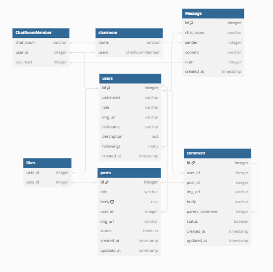

# Pe-chesse

## Peach-Market

Peach-Market은 복숭아를 판매하는 온라인 마켓 웹사이트입니다.   
우리는 복숭아의 매력을 한 눈에 알아볼 수 있게 다양한 복숭아 관련 상품을 제공하고자 합니다.  
특히, 농부 및 제작자들과 소비자들 사이의 다리 역할을 하며, 이를 통해 지역적으로 생산된 농산물 소비를 장려하고 소비자들에게 더욱 신선하고 다양하고 풍성한 옵션을 제공합니다.

**Peach-Market**과 함께 복숭아의 세계로 떠나보시는 건 어떨까요? 🍑🛒

## Repo

#### Be

[Peach-Market](https://github.com/Pe-chesse/Peach-Market)

#### Fe

[Peach-Fe](https://github.com/Pe-chesse/Peach-Fe)

## 배포

## 인원구성

- BE/FE 5명

## 기간

- 2023.08.10. ~ 2023. 09. 04. ()

## Skill Set

- Programing Languages
  - Python
  - JavaScripts(ES6)
  - HTML5
  - CSS3
- Framework / Library
  - Django, Django REST framework
- Server
  - PostgreSQL, ERD
- Tooling / DevOps
  - Docker, AWS, Amazon S3, GitHub, Git, DBeaver
- Environment
  - AWS
- ETC
  - Discord
  - Notion
  - Postman
  - Figma

## ERD (Entity-Relationship Diagram)

## Design

Figma를 통해 디자인을 구성하고 기획했습니다 

[Figma](https://www.figma.com/file/j1pxmegC0PiM2HknjA6Jcs/Peach-Market?type=design&node-id=0%3A1&mode=design&t=6nCqFChKDJod4pcd-1)

## 기능 설명

### 로그인 및 회원가입

##### 로그인

- 사용자 인증을 통해 계정에 로그인하는 기능입니다
- 'ProtectedApiView' 클래스를 통해 사용자의 정보를 확인하고, 해당 정보를 JSON 형식으로 반환합니다

##### 회원가입

- 사용자가 새로운 계정을 생성하는 기능입니다
- 'UserApiView' 클래스의 'put' 메서드를 사용하여 사용자 정보를 수정하고 저장합니다

##### 닉네임 중복 확인

- 회원가입 시 닉네임 중복 여부를 확인하는 기능입니다
- 'NicknameVerifyApiView' 클래스의 'get' 메서드를 사용하여 입력된 닉네임이 이미 다른 사용자의 닉네임과 중복되는 지 확인합니다

### 프로필 수정

- 프로필 페이지에서 사용자 정보를 수정할 수 있습니다
- 'UserApiView' 클래스의 'put' 메서드에서 사용자가 입력한 수정 정보를 처리하고, 해당 정보를 업데이트합니다

### 채팅 기능

##### 채팅방 생성 및 접속

- 사용자가 다른 사용자와의 채팅방을 생성하고 접속하는 기능입니다
- 'ChatRoomAPIView' 클래스의 'post' 메서드를 통해 새로운 채팅방을 생성하고, 해당 채팅방에 참여하는 사용자들을 등록합니다
- 채팅방의 이름은 사용자들의 정보를 바탕으로 해싱하여 생성되며, 채팅방은 이미 존재할 경우 해당 채팅방을 사용하고, 없을 경우 새로운 채팅방을 생성합니다

##### 채팅 메세지 조회

- 특정 채팅방의 채팅 메시지를 조회하는 기능입니다
- 'ChatMessageListView' 클래스의 'post' 메서드를 통해 채팅방의 이름과 조회할 메세지의 최대 번호를 입력 받습니다
- 해당 채팅방에 권한이 있는 사용자만 메세지를 조회할 수 있습니다
- 조회한 메시지들은 시간 순으로 정렬하여 최근 메시지부터 최대 30개 까지 반환합니다

### 게시판 및 상품 기능

##### 상품 목록 조회

- 'ProductList' 클래스는 모든 상품을 조회하는 기능을 제공합니다
- 특별한 권한이 필요하지 않으며, 모든 사용자가 접근할 수 있습니다

##### 상품 등록

- 'ProductWrite' 클래스는 새로운 상품을 등록하는 기능을 제공합니다
- 요청한 사용자의 정보를 포함하여 상품 정보를 저장합니다

##### 상품 수정

- 'ProductUpdate' 클래스는 기존의 상품을 수정하는 기능을 제공합니다
- 수정하려는 상품의 정보와 변경할 내용을 요청한 사용자의 정보와 함께 업데이트합니다

##### 상품 삭제

- 'ProductDelete' 클래스는 기존의 상품을 삭제하는 기능을 제공합니다
- 삭제하려는 상품의 정보를 찾아 삭제합니다

##### 상품 상세 조회

- 'ProductDetail' 클래스는 특정 상품의 상세 정보를 조회하는 기능을 제공합니다
- 모든 사용자가 접근할 수 있습니다

##### 게시글 목록 조회 및 작성

- 'PostList' 클래스는 모든 게시글을 조회하고 새로운 게시글을 작성하는 기능을 제공합니다
- 코드 속 'Post' 모델과 관련된 기능들입니다

##### 게시글 수정, 삭제 및 댓글 작성

- 'PostAPIView' 클래스는 게시글의 수정, 삭제와 댓글 작성을 담당하는 기능을 제공합니다
- 사용자는 자신이 작성한 게시글만 수정 및 삭제할 수 있습니다

##### 좋아요

- 'LikeAPIView' 클래스는 게시글에 좋아요를 누르거나 취소하는 기능을 제공합니다

##### 댓글 수정 및 삭제

- 'CommentDetailView' 클래스는 댓글의 수정과 삭제를 처리하는 기능을 제공합니다
- 사용자는 자신이 작성한 댓글만 수정 및 삭제할 수 있습니다

### 검색 기능

##### 사용자 정보 조회

- 사용자의 닉네임을 이용하여 해당 사용자의 정보를 조회합니다
- 'UserApiView' 클래스의 'get' 메서드에 입력된 사용자 닉네임을 통해 해당 사용자를 검색하고, 그 사용자의 정보를 프로필 페이지에 출력합니다

##### 사용자 게시글 조회

- 사용자 프로필 페이지에서는 해당 사용자가 작성한 게시글 목록을 조회할 수 있습니다
- 'Post' 모델과 'PostListSerializer'를 활용하여 사용자가 작성한 게시글들을 조회하고, 이를 프로필 페이지에 출력합니다

## 사용 예제

1. 사용자는 회원가입을 통해 계정을 생성하고 로그인합니다.
2. 사용자 프로필 페이지에서 프로필 정보를 확인하고 수정합니다.
3. 채팅 목록에서 채팅방을 선택하여 실시간으로 대화합니다.

<!-- ## 기여

만약 Peach-Market 프로젝트에 기여하고 싶다면, 이슈를 제기하거나 Pull Request를 보내주세요 -->

## Contributor

- 김민기 [prin6850@gmail.com]
- 김여주 [yeojoo0031@gmail.com]
- 김준균 [jg55552758@gmail.com]
- 노희연 [heeyeon1213@gmail.com]
- 정승일 [jungsi1217@gmail.com]
